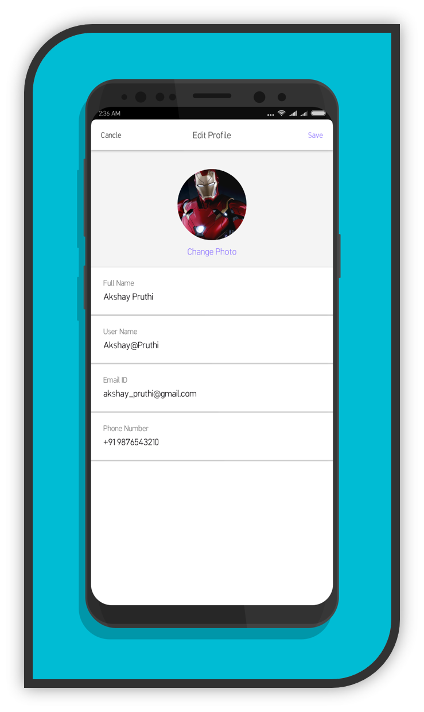
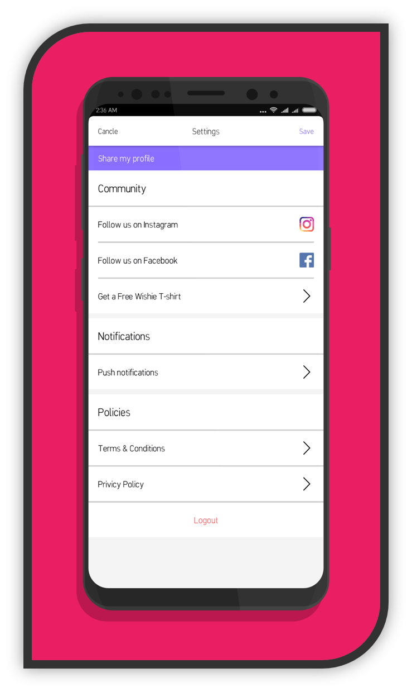
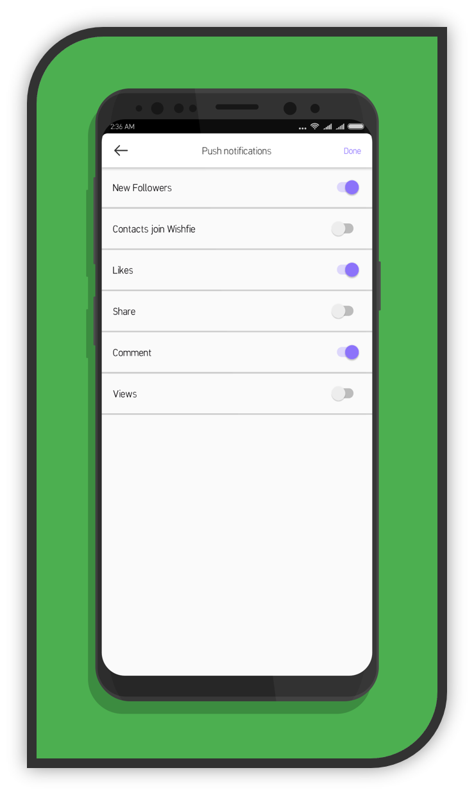

# Wishfie
**Wishfie** is a video messenger to help you voice your opinions, debate hot news, stories, politics & trending topics using your selfie-camera. Get people's opinions and watch viral video clips of public opinions on **trending topics**. Enjoy advanced video filters, anonymous video & polls.  

**Note:** This mobile application is neither **owned** nor maintained my me in any means. I just **contributed** on user interface of this application. Do checkout my work in screenshots section of this page.

## Screenshots
Apk of every page is available right here, click on the screenshots to download appropriate apk file.  

## Download
Visit their official playstore page and grab it now to debate on hot news, stories, politics & trending topics.  

